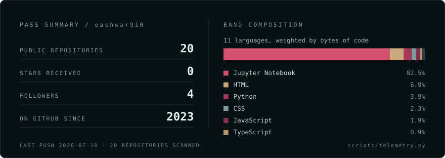

<div align="center">
  
</div>

<p align="center">
  <a href="https://www.linkedin.com/in/CHANGE-ME/"></a>
  &nbsp;&nbsp;
  <a href="mailto:CHANGE-ME@example.com"></a>
</p>


## <samp>WHO</samp>

Second-year computer science and AI student. Most of what I build starts as a raster — a satellite scene, a drone pass, a photograph of a leaf — and ends as a number somebody can act on: which plot is water-stressed, where the canopy thinned since the last overpass, what changed and by how much.

The half I actually enjoy is the unglamorous one. Reprojections that refuse to line up. Cloud sitting exactly over the field you care about. Labels that three people would draw three different ways. I'd rather fix the data than stack another layer onto the model, and I'm still learning to read the histogram before reaching for the network.

## <samp>INSTRUMENTS</samp>

```text
╭──────────────────────────────────────────────────────────────────────────╮
│  BAND           INSTRUMENTS                                              │
├──────────────────────────────────────────────────────────────────────────┤
│  LANGUAGES      python · c · java · typescript · javascript · php        │
│                                                                          │
│  IMAGERY / ML   pytorch · tensorflow · keras · opencv · scikit-learn ·   │
│                 numpy · pandas · matplotlib                              │
│                                                                          │
│  INTERFACES     react native · expo · tailwind · node.js · javafx ·      │
│                 html5 · css3                                             │
│                                                                          │
│  DATA + CLOUD   postgres · supabase · firebase · google cloud ·          │
│                 digitalocean · vercel · netlify                          │
│                                                                          │
│  WORKBENCH      git · github actions · npm · anaconda                    │
╰──────────────────────────────────────────────────────────────────────────╯
```

## <samp>IN FLIGHT</samp>

```text
NOW        segmentation on multispectral field imagery
NEXT       change detection across repeat passes
LEARNING   pytorch internals · postgis · writing about the work
OPEN TO    research assistant roles, internships, ag-tech builds
```

## <samp>SIGNAL</samp>



<details>
<summary><samp>how this page is drawn</samp></summary>

<br>

Nothing here comes from a badge host or a profile generator. Four files do the work:

```text
assets/banner.svg       false-colour field mosaic, plotted parcel by parcel
assets/telemetry.svg    rebuilt from the GitHub API by scripts/telemetry.py
assets/chip-*.svg       contact chips, 38px, hand-drawn glyphs
assets/divider.svg      the soil → canopy ramp, reused as a rule
```

The header is a scene, not a photo: irregular plots in a near-infrared composite, where vigorous canopy reads magenta and bare soil reads tan, over a faint 8&nbsp;px pixel grid. One slow sweep crosses it, and stops entirely if your system asks for reduced motion.

The stats panel is regenerated by a scheduled action, which reads my public repositories, weights languages by bytes of code rather than repository count, and commits the SVG only when a number actually moves.

</details>


<p align="center"><samp>no badge services &nbsp;·&nbsp; no generators &nbsp;·&nbsp; every asset above is hand-written svg</samp></p>
